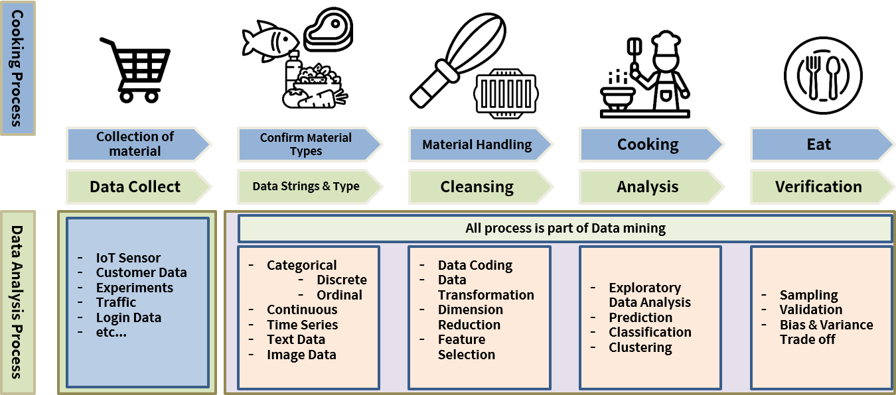

### Data Scientist/Analyst = Statistics
Before Analysis Clarify:
- Objective of analysis: reduce cost
- Compete and Win against know-how and process in real field
- Understand the domain/field of the subject
- Know statistics
### SQL, Excel, R, Python
- SQL: necessary for DB handling
- R: Data handling, statistics, modelling, ML, visualisation
- Python: ML, Deep learning, Reinforcement learning, Development (Linux)

Excel cons
- Bad for large data (laggy)
- limited analysis tools

R pros
- Good for large data
- Prepared data analysis scripts, packages, open-source

R cons
- High memory consumption 
- Not the fastest calculation speed

### Basic probability
| Situation                                     | Name                  | Formula         | 
| --------------------------------------------- | --------------------- | --------------- | 
| Probability of being late                     | Prior probability     | ( P(E) )        |
| Probability of taking the bus and being late  | Joint probability     | ($ P(E \cap B) $ ) |
| Probability of being late given bus was taken | Conditional probability | ($ P(E \| B) $) |
| Probability that bus was taken given lateness | Likelihood            | ($ P(B \| E) $) |

### Data post processing is 80~90% of the all work

